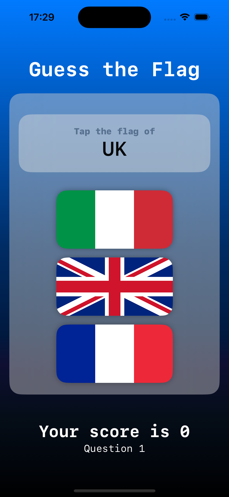
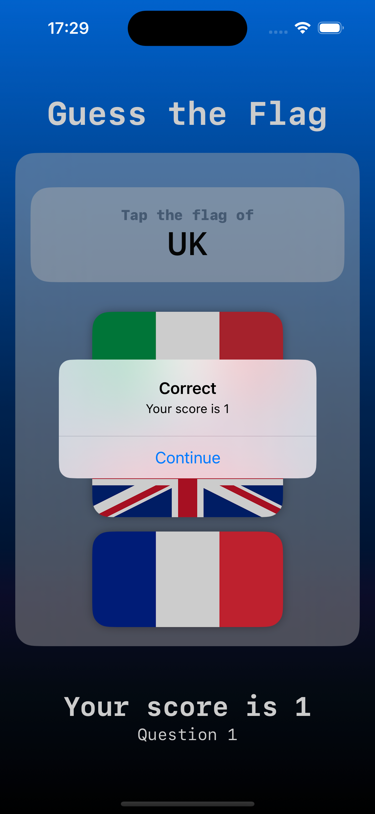

# GuessTheFlag

GuessTheFlag is a simple SwiftUI app that tests your knowledge of world flags. You'll be presented with a flag, and your task is to guess which country it represents from a list of options.

## Features

- View a country name and select the correct country from multiple choices.
- Keep track of your score as you progress through the game.
- Learn about different flags from around the world in a fun way.

## Requirements

- iOS 14.0+
- Xcode 12.0+
- Swift 5.3+

## Usage

- Launch the app on your device or simulator.
- You'll see a country displayed on the screen along with multiple choice flag options.
- Select the correct country by tapping on its name.
- Receive instant feedback on whether your guess was correct or not.
- Keep playing to improve your knowledge of world flags and beat your high score.

## Screenshots

## License

This project is licensed under the [LICENSE](LICENSE).
